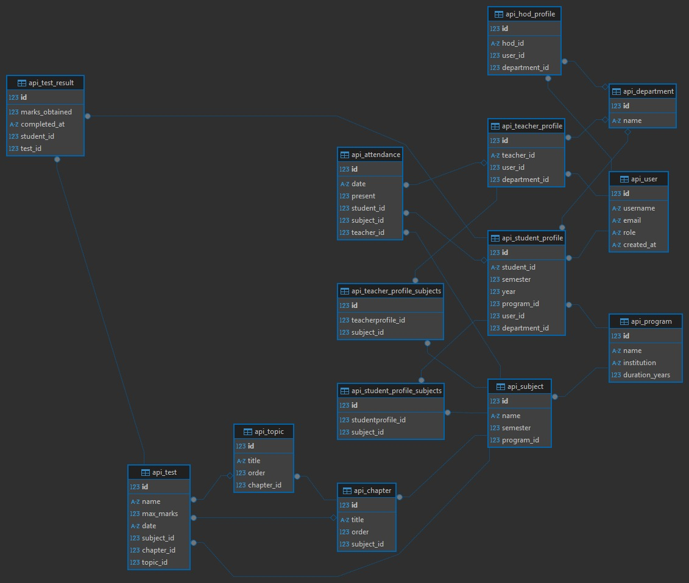

# LMS Virtual Assistant Enhancement Report

## Objective

The objective of this project was to enhance the virtual assistant functionality integrated into the LMS (Learning Management System) platform. The assistant has been upgraded to offer role-specific academic insights, query understanding through natural language processing (NLP), attendance analysis, and voice functionality support. These improvements aim to make the assistant more interactive, informative, and beneficial to students, teachers, and department heads (HODs).

## Features Implemented

### Role-Based Functionality

The assistant dynamically identifies the user's role—student, teacher, or HOD—using the following models:

* `users.models.user.User`
* `users.models.student.StudentProfile`
* `users.models.teacher.TeacherProfile`
* `users.models.hod.HodProfile`

This enables customized responses and insights relevant to each role.

### Intent Recognition and Smart Routing

* A **Sentence-BERT** model (`paraphrase-MiniLM-L6-v2`) is used to semantically understand user queries.
* Intent detection is handled in `Assistant/handlers/intent_router.py`, which maps queries to specific functions based on cosine similarity.
* Queries are routed to appropriate handlers via `Assistant/handlers/router.py`.

### Student-Oriented Features

* **Academic Performance Summary**: Students receive a detailed breakdown of their performance, including subject, chapter, and topic-level accuracy.
* **Improvement Suggestions**: Based on performance data, the assistant provides personalized feedback on weak topics.
* **Attendance Summary**: Students can view their attendance records and attendance percentages using the attendance model.
* **Top and Bottom Performers**: Students can view class toppers and identify where they stand compared to peers.

### Teacher-Oriented Features

* **Class Performance Analysis**: Teachers receive insights into how their students are performing in each subject.
* **Weak Topic Aggregation**: Identifies chapters and topics where the class is collectively underperforming.
* **Attendance Monitoring**: Teachers can view attendance summaries across their sessions using the attendance model.
* **Advice for Class Improvement**: Suggestions are provided based on test data to help improve teaching strategies.

### HOD-Oriented Features

* **Department-Wide Analysis**: HODs can view subject-wise and semester-wise performance across the department.
* **Collective Weakness Detection**: Aggregated insights into weak areas based on test results from all students in the department.
* **Attendance Summary**: Displays department-level attendance statistics using the attendance model.
* **Improvement Guidance**: Suggestions are generated for department-wide academic improvement.

### Voice Functionality (Optional)

Voice functionality has been integrated with the potential to enable in production environments:

* **Speech Recognition**: Captures voice input using the `speech_recognition` library.
* **Text-to-Speech**: Converts responses to speech using `pyttsx3`.
  These functionalities are currently commented out to provide flexibility for deployment and performance considerations.

### Navigation and Dataset Response

* A structured JSON dataset (`Assistant/data/dataset.json`) contains static queries, FAQs, and navigation paths.
* The assistant can respond with navigation assistance or redirection to specific LMS pages when appropriate.

## Models Used

### User & Role Models

* `User` – `users.models.user`
* `StudentProfile` – `users.models.student`
* `TeacherProfile` – `users.models.teacher`
* `HodProfile` – `users.models.hod`

### Academic Structure Models

* `Program` – `program.models.program`
* `Subject`, `Chapter`, `Topic` – `program.models.subject`, `program.models.chapter`, `program.models.topic`

### Assessment Models

* `Test`, `TestResult` – `assessment.models.test`, `assessment.models.test_result`

### Attendance Model

* `Attendance` – `attendance.models.attendance`

### Model Workflow

## Workflow Summary

1. **User Input** (via text or voice)
2. **Role Identification** based on linked profile models
3. **Intent Detection** using sentence embeddings and similarity comparison
4. **Routing** to appropriate handler logic
5. **Response Generation** including:

   * Academic insights
   * Attendance summaries
   * Navigation links
   * Performance-based advice

## Conclusion

This enhancement project significantly improves the intelligence, usability, and value of the LMS virtual assistant. It now acts as a context-aware academic support system, providing customized responses and actionable feedback. It empowers users—students, teachers, and HODs—to make data-informed decisions, identify academic gaps, monitor attendance, and improve overall performance within the learning management ecosystem.
